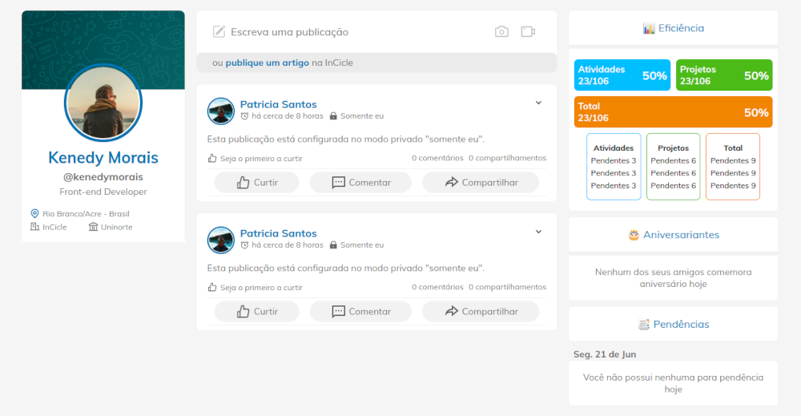

<h1 align="center">
  Front-end Test
</h1>

<p align="center">
  
</p>

## :rocket: Ferramentas usadas

-   [ReactJS](https://reactjs.org/)
-   [React Router](https://reactrouter.com/)
-   [React Icons](https://react-icons.github.io/react-icons/)
-   [Styled Components](https://styled-components.com/)
-   [ESLint](https://eslint.org/)
-   [Prettier](https://prettier.io/)
-   [EditorConfig](https://editorconfig.org/)

## :information_source: Como usar

Para clonar e executar esta aplicação, necessitará [Git](https://git-scm.com), [Node.js v10.16](https://nodejs.org/en/) ou superior e [Yarn v1.13](https://yarnpkg.com/) ou superior instalado no seu computador. A partir da sua linha de comando:

```bash
# Clonar o repositório
$ git clone https://github.com/CaioMantovaniBorba/front-end-test

# Ir para a pasta do repositório
$ cd front-end-test

# Instalar as dependências
$ yarn install

# Rodar a app
$ yarn start
```
